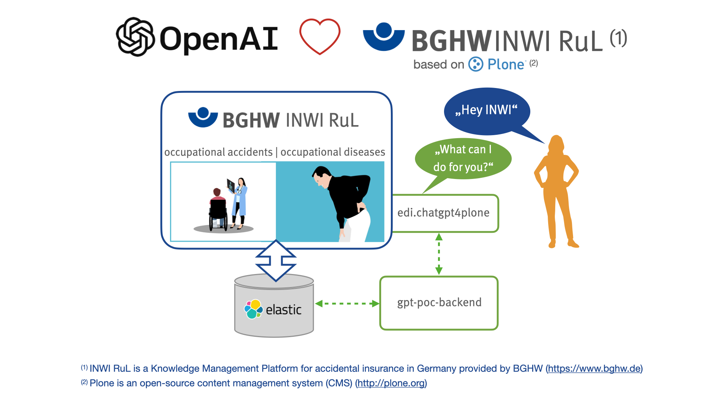

# edi.chatgpt4plone

This add-on is a "Proof of Concept" (poc) prototype for integration of ChatGPT3 in Web-CMS Plone. This add-on and the additional system enhancement
"gpt-poc" are working on the shoulders of the great LLM-Framework (LLM = Large Language Model) [LangChain](https://python.langchain.com/en/latest/index.html).
In our first release we assume that the plone site is connected with an local elastic search engine. For the integration of
elastic search in plone we use the add-on [collective.elasticsearch](https://pypi.org/project/collective.elasticsearch/).

**The base idea is to use the famous LLM ChatGPT3 from openAI together with an own content-database provided by an elastic search engine. The AI-based creative
process to generate answers for prompted questions should use own information sources only!**

The system enhancement gpt-poc will start a websocket-server based application to build a "bridge" between Plone Web-CMS, LLM (using LangChain), the  
elastic search engine and some other small dependencies illustrated in figure-1.



**With this concept the ChatGPT3 Integration will work for other web application environments and other Web-CMS Systems too.**

Thanks to all authors and conributors of used dependencies.

## Requirements

* [Developer Account](https://platform.openai.com/overview) at openAI to generate and download an API-Key for ChatGPT.
* Local installation of elastic search engine (port 9200) to store private content. Here you can find [installation instructions for Ubuntu](https://www.elastic.co/guide/en/elasticsearch/reference/8.7/deb.html).
* Local installation of web cms Plone via buildout. Here you can find [installation instructions for Plone](https://plone.org/download) 

## Installation

### Install and configure the linux system enhancement gpt-poc

gpt-poc will therefore deliver a client-part (javascript web-component) and a backend-part for communication with Plone Web-CMS, LLM and elastic search engine. 

#### Install gpt-poc with ubuntu package manager

``` bash
sudo add-apt-repository ppa:educorvi/experimental
sudo apt update
sudo apt install python3-gpt-poc-backend
```

After successfully installation you have to configure the gpt-poc backend by the following steps:

``` bash
cd /etc/gpt-poc
sudo cp conf.template.yaml conf.yaml
sudo vi conf.yaml
```
Example:

``` bash
OpenAI:
  API_KEY: sk-xxxxxxxxxxxxxxxbkFJS9KbUAQtjNAWh4y0X6zE

ElasticSearch:
  url: "http://localhost:9200"
  index: inwiportal-portal_catalog_1
  result_size: 2

Websocket:
  port: 8765
```

Now you can start|stop the websocket server with the following commands:

``` bash
sudo systemctl start gpt-poc-backend
sudo systemctl stop gpt-poc-backend
```

Check if websocket server runs correct

``` bash
sudo systemctl status gpt-poc-backend
● gpt-poc-backend.service - GPT POC Backend Service
     Loaded: loaded (/lib/systemd/system/gpt-poc-backend.service; disabled; vendor preset: enabled)
     Active: active (running) since Sat 2023-06-10 19:21:41 UTC; 5s ago
   Main PID: 2088110 (gpt-poc-backend)
      Tasks: 4 (limit: 9257)
     Memory: 80.4M
        CPU: 4.761s
     CGroup: /system.slice/gpt-poc-backend.service
             └─2088110 /usr/bin/python3 /usr/bin/gpt-poc-backend

Jun 10 19:21:41 ubuntu-8gb-nbg1-2 systemd[1]: Started GPT POC Backend Service.
```

#### Install gpt-poc via github checkout in local homefolder

``` bash
cd ~
git clone https://github.com/educorvi/gpt-poc.git
cd gpt-poc/backend
sudo make install
```

After successfully installation you have to configure the gpt-poc backend by the following steps:

``` bash
cd /etc/gpt-poc
sudo cp conf.template.yaml conf.yaml
sudo vi conf.yaml
```
Example:

``` bash
OpenAI:
  API_KEY: sk-xxxxxxxxxxxxxxxbkFJS9KbUAQtjNAWh4y0X6zE

ElasticSearch:
  url: "http://localhost:9200"
  index: inwiportal-portal_catalog_1
  result_size: 2

Websocket:
  port: 8765
```

To start the websocket-server in foreground do the following:

``` bash
cd ~
cd gpt-poc/backend
./gpt-poc-backend
```

To stop websocket-server type: ``` CTRL-C ```

### Install and configure addons for CMS Plone

Clone the package edi.chatgpt4plone to src directory of your buildout instance:

``` bash
cd src
git clone https://github.com/educorvi/edi.chatgpt4plone.git
```

Install edi.chatgpt4plone and collective.elasticsearch by adding it to your buildout::

``` python

    [buildout]

    ...

    eggs =
        edi.chatgpt4plone
        collective.elasticsearch

    develop = 
        src/edi.chatgpt4plone
```

and then running ``` bin/buildout ```

After successful installation you must install and configure both addons for your Plone site via plone_controlpanel:

* you must **enable elastic search** an **rebuild the portal-catalog**
* for this initial relase only the following config-entries for chatgpt4plone are required:
  * URI of websocket server: ws://your.server.domain
  * Port of websocket server: 8765 # Default Value


## Sources

### gpt-poc

[https://github.com/educorvi/gpt-poc](https://github.com/educorvi/gpt-poc)

### edi.chatgpt4plone

[https://github.com/educorvi/edi.chatgpt4plone](https://github.com/educorvi/edi.chatgpt4plone)

## Support

[Issue Tracker](https://github.com/educorvi/edi.chatgpt4plone/issues)

If you are having issues, please let us know.
[info@educorvi.de](info@educorvi.de)

## License

The project is licensed under the MIT Licence.
